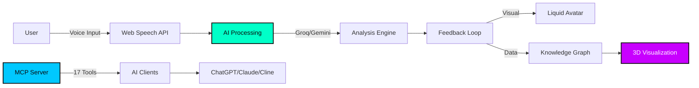

<div align="center">

# Explainr

### AI-Powered Learning Through the Feynman Technique

[](https://nextjs.org/)
[](https://www.typescriptlang.org/)
[](https://vercel.com)
[](https://modelcontextprotocol.io)
[](LICENSE)

**[Live Demo](https://explainr.vercel.app)** • **[Documentation](docs/)** • **[MCP Integration](#mcp-server-integration)**

---

*"If you can't explain it simply, you don't understand it well enough."* — Richard Feynman

</div>

---

## Overview

**Explainr** transforms passive learning into active mastery. By forcing you to articulate concepts in your own words to AI personas, it exposes gaps that passive reading never reveals. The result? Deeper comprehension, longer retention, and genuine expertise.

### The Problem

Traditional learning is passive. You read, watch videos, take notes—but never truly test your understanding until it's too late. By then, you've wasted hours on surface-level comprehension.

### The Solution

**Explainr makes you the teacher.** Explain concepts out loud to AI personas that challenge you at different levels. Get instant feedback. Watch your knowledge graph expand. Build genuine mastery through active recall.

---

## Core Features

<table>
<tr>
<td width="33%" align="center">

### Adaptive AI Personas

Choose from 5 distinct personalities designed to challenge you differently:

**Toddler** → Forces simplicity  
**Peer** → Tests practical understanding  
**Frat Bro** → Demands relatable analogies  
**CEO** → Connects theory to business value  
**Professor** → Requires academic precision

Each persona adapts questions based on your confusion level.

</td>
<td width="33%" align="center">

### Voice-First Learning

Speak naturally while AI analyzes:

**Pace** → Hesitation patterns  
**Clarity** → Coherence of explanation  
**Confidence** → Vocal certainty  
**Jargon** → Hiding behind buzzwords

No typing. No friction. Pure explanation.

</td>
<td width="33%" align="center">

### Knowledge Galaxy

Your learning journey as an interactive 3D constellation:

**Nodes** → Mastered topics  
**Connections** → Semantic relationships  
**Size** → Mastery level  
**Color** → Practice recency

Watch isolated facts become interconnected understanding.

</td>
</tr>
</table>

---

## Gamification System

<div align="center">

| Feature | Purpose |
|---------|---------|
| **XP System** | Earn points for quality explanations |
| **Daily Streaks** | Build consistent learning habits |
| **Commitment Grid** | GitHub-style activity visualization |
| **Level Progression** | Unlock achievements as you master topics |
| **Liquid Avatar** | Real-time visual feedback on AI confusion |

</div>

---

## Architecture



---

## MCP Server Integration

### Your Learning Data, Everywhere

Explainr includes a **Model Context Protocol (MCP) server** that makes your knowledge graph accessible from any AI assistant.

**One learning system. Every AI tool.**

<div align="center">

| Platform | Use Case | Setup Time |
|----------|----------|------------|
| **VS Code (Cline)** | Code while you learn | 2 min |
| **Claude Desktop** | Deep technical discussions | 2 min |
| **ChatGPT Desktop** | Quick queries & casual learning | 2 min |

</div>

### Real-World Examples

**Developers (VS Code + Cline)**
```
You: "Create an Explainr session on React Hooks"
Cline: *Starts voice session*
You: *Explains useState and useEffect*
Cline: "85% mastery. Added to knowledge graph."
```

**Researchers (Claude Desktop)**
```
You: "Search my sessions for neural networks"
Claude: *Returns 3 sessions with summaries*
You: "Show connections"
Claude: *Displays semantic relationships*
```

**Students (ChatGPT Desktop)**
```
You: "What should I review before my exam?"
ChatGPT: "3 topics below 60%: Thermodynamics (45%), 
Quantum Mechanics (52%), Statistical Mechanics (58%)"
```

### Quick Setup

<details>
<summary><b>VS Code (Cline)</b></summary>

1. Install Cline extension
2. Add to MCP settings:

```json
{
  "mcpServers": {
    "explainr": {
      "command": "node",
      "args": ["path/to/explainr/mcp-server/dist/index.js"]
    }
  }
}
```

3. Restart VS Code
4. Try: `"Create a Docker session with professor persona"`

</details>

<details>
<summary><b>Claude Desktop</b></summary>

**Config:** `~/Library/Application Support/Claude/claude_desktop_config.json` (Mac)  
**Config:** `%APPDATA%\Claude\claude_desktop_config.json` (Windows)

```json
{
  "mcpServers": {
    "explainr": {
      "command": "node",
      "args": ["C:\\path\\to\\explainr\\mcp-server\\dist\\index.js"]
    }
  }
}
```

Restart Claude Desktop.

</details>

<details>
<summary><b>ChatGPT Desktop</b></summary>

**Config:** `%APPDATA%\OpenAI\ChatGPT\mcp_config.json` (Windows)  
**Config:** `~/Library/Application Support/OpenAI/ChatGPT/mcp_config.json` (Mac)

Same format as Claude. Restart ChatGPT Desktop.

</details>

**Full Guide:** [MCP-SETUP.md](MCP-SETUP.md) • **17 Tools:** [TOOLS.md](mcp-server/TOOLS.md)

---

## Quick Start

### Deploy to Vercel

[](https://vercel.com/new/clone?repository-url=https://github.com/codewithadvi/Explainr)

**Required Environment Variables:**
```env
GROQ_API_KEY=your_groq_key
GOOGLE_GEMINI_API_KEY=your_gemini_key
```

**Get Free API Keys:**  
→ [Groq Console](https://console.groq.com/keys)  
→ [Google AI Studio](https://aistudio.google.com/app/apikey)

---

## Technology Stack

<div align="center">

| Layer | Technologies |
|-------|-------------|
| **Frontend** | Next.js 14, React 18, TypeScript 5 |
| **Styling** | Tailwind CSS, Framer Motion |
| **3D Graphics** | Three.js, React Three Fiber |
| **AI** | Groq (Llama 3), Google Gemini 1.5 |
| **Voice** | Web Speech API |
| **Protocol** | Model Context Protocol (MCP) |
| **Deployment** | Vercel Edge Network |

</div>

---

## Use Cases

**Students** → Master complex subjects faster with active recall  
**Developers** → Learn new technologies while coding  
**Researchers** → Explain findings to validate understanding  
**Educators** → Assess student comprehension interactively  
**Self-Learners** → Build genuine expertise, not surface knowledge

---

## Contributing

Contributions welcome! See [CONTRIBUTING.md](CONTRIBUTING.md) for guidelines.

**Ways to Contribute:**
- Report bugs or suggest features
- Add new AI personas
- Enhance visualizations
- Improve documentation

---

## License

MIT License - see [LICENSE](LICENSE) for details.

---

<div align="center">

**Built for learners who refuse to settle for surface-level understanding**

[⭐ Star](https://github.com/codewithadvi/Explainr) • [🐛 Issues](https://github.com/codewithadvi/Explainr/issues) • [💡 Features](https://github.com/codewithadvi/Explainr/issues)

</div>
