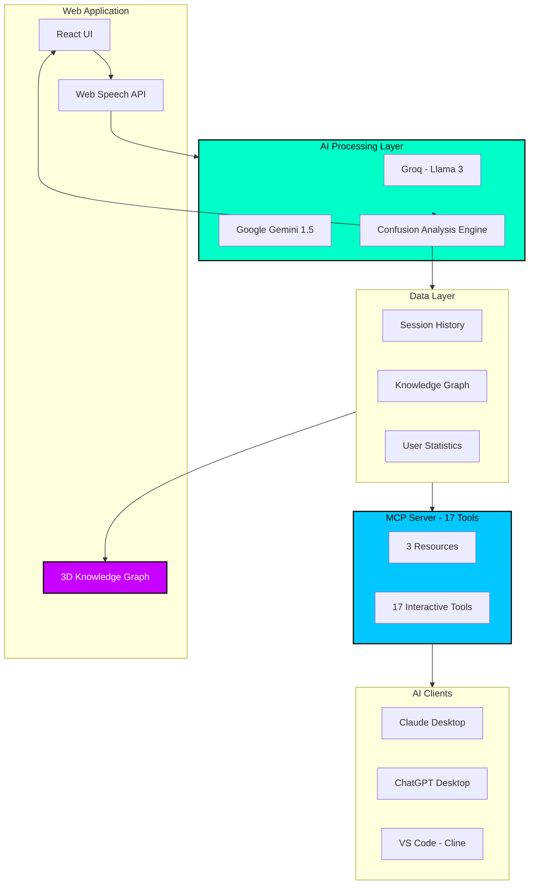

<div align="center">


# Explainr

### The Feynman Technique, Powered by AI

[](https://nextjs.org/)
[](https://www.typescriptlang.org/)
[](https://react.dev/)
[](https://threejs.org/)
[](https://tailwindcss.com/)
[](https://explainr.vercel.app)

[](https://modelcontextprotocol.io)
[](https://groq.com/)
[](https://ai.google.dev/)
[](LICENSE)

<br/>

**[Live Demo](https://explainr.vercel.app)** | **[MCP Setup Guide](MCP-SETUP.md)** | **[Full Tool Reference](mcp-server/TOOLS.md)**

<br/>

---

*"If you can't explain it simply, you don't understand it well enough."*

-- Richard Feynman

---

</div>

<br/>

## The Story Behind Explainr

My dad always told me something that stuck with me:

> **"If you can't explain something, you don't really know it."**

That simple truth became the foundation of how I approach learning. I noticed that whenever I tried to explain a concept to someone who knew nothing about it, something interesting would happen. They would ask basic questions. Rudimentary ones. The kind of questions that seem almost too simple.

But here is the thing: **answering those simple questions is actually the hard part.**

When you explain something technical to a complete beginner, they start from zero. They ask "why" constantly. They need analogies and real-world connections. They force you to break down complex ideas into digestible pieces. And in doing so, *they expose every gap in your understanding.*

This is the Feynman Technique in action, and it works because active recall and teaching are the most powerful learning methods we know of.

I built Explainr because I wanted a way to practice this technique anytime, anywhere, without needing to find a patient friend willing to listen to me ramble about distributed systems at 2 AM.

Whether you are a student mastering difficult subjects, a developer learning new technologies, or even a CTO who needs to explain technical concepts to clients and customers of all backgrounds, **the ability to make the complex simple is the ultimate proof of understanding.**

Explainr makes you the teacher. And in teaching, you truly learn.

---

## What Is Explainr?

**Explainr** transforms passive learning into active mastery. Instead of passively consuming content, you explain concepts out loud to AI personas that challenge you at different comprehension levels. The AI adapts its questions based on your clarity, exposes your knowledge gaps in real-time, and tracks your progress in an interactive 3D knowledge galaxy.

<div align="center">

| The Problem | The Solution |
|-------------|--------------|
| Passive learning never reveals true understanding | Active recall through teaching exposes every gap |
| No feedback on explanation clarity | AI analyzes pace, confidence, and jargon usage |
| Isolated facts without connections | Visual knowledge graph shows topic relationships |
| Motivation fades without progress tracking | XP, streaks, levels, and achievements keep you engaged |

</div>

---

## Core Features

<table>
<tr>
<td width="33%" valign="top">

### Adaptive AI Personas

Five distinct personalities that challenge you differently:

| Persona | Challenge |
|---------|-----------|
| **Toddler** | Forces absolute simplicity |
| **Peer** | Tests practical understanding |
| **Frat Bro** | Demands relatable analogies |
| **CEO** | Connects theory to business value |
| **Professor** | Requires academic precision |

Each persona adapts questions based on your confusion level, pushing deeper when you are strong and clarifying when you struggle.

</td>
<td width="33%" valign="top">

### Voice-First Learning

Speak naturally while AI analyzes your explanation in real-time:

| Metric | What It Reveals |
|--------|-----------------|
| **Pace** | Hesitation indicates uncertainty |
| **Clarity** | Coherence of your explanation |
| **Confidence** | Vocal certainty vs. doubt |
| **Jargon** | Hiding behind buzzwords |

No typing walls of text. No friction. Just pure explanation and instant feedback through a responsive liquid avatar that reacts to AI confusion.

</td>
<td width="33%" valign="top">

### Knowledge Galaxy

Your learning journey visualized as an interactive 3D constellation:

| Element | Meaning |
|---------|---------|
| **Nodes** | Mastered topics |
| **Connections** | Semantic relationships |
| **Size** | Mastery level |
| **Color** | Practice recency |

Click any node to review that topic. Watch isolated facts transform into interconnected understanding over time.

</td>
</tr>
</table>

---

## Gamification System

Learning is more effective when it feels rewarding. Explainr includes a complete gamification layer:

<div align="center">

| Feature | Description |
|---------|-------------|
| **XP System** | Earn experience points for quality explanations, not just time spent |
| **Level Progression** | Advance through ranks as you master more topics |
| **Daily Streaks** | Build consistent learning habits with streak tracking |
| **Commitment Grid** | GitHub-style contribution visualization for your learning activity |
| **Liquid Avatar** | Real-time visual feedback that reacts to AI confusion levels |
| **Gap Analysis** | AI-powered recommendations for what to study next |

</div>

---

## Technology Stack

<div align="center">

| Layer | Technologies |
|-------|-------------|
| **Frontend** | Next.js 14, React 18, TypeScript 5 |
| **Styling** | Tailwind CSS 3.4, Framer Motion 11 |
| **3D Graphics** | Three.js 0.160, React Three Fiber, Drei |
| **AI Providers** | Groq (Llama 3), Google Gemini 1.5 |
| **Voice** | Web Speech API (Browser Native) |
| **Protocol** | Model Context Protocol (MCP) |
| **Deployment** | Vercel Edge Network |
| **State** | Local Storage with JSON Persistence |

</div>

---

## System Architecture



---

## MCP Server Integration

### Your Learning Data, Everywhere

Explainr includes a full **Model Context Protocol (MCP) server** that exposes your knowledge graph and learning data to any MCP-compatible AI assistant. This means you can interact with your Explainr data from Claude Desktop, ChatGPT Desktop, VS Code with Cline, or any other MCP client.

<div align="center">

| Resources (3) | Description |
|--------------|-------------|
| `knowledge://graph` | Full knowledge graph with nodes and relationships |
| `sessions://list` | Complete history of learning sessions |
| `stats://user` | XP, level, streak, and commitment grid data |

</div>

<div align="center">

| Tool Category | Count | Capabilities |
|---------------|-------|--------------|
| **Read-Only** | 6 | Search sessions, get topic connections, view progress |
| **Session Management** | 5 | Create, update, rename, delete sessions |
| **Knowledge Graph** | 3 | Add, update, delete topics and mastery levels |
| **Data Management** | 3 | Export, import, clear all data |
| **Total** | **17** | **Full website functionality via AI** |

</div>

### Quick Setup

<details>
<summary><b>VS Code with Cline Extension</b></summary>

1. Install the **Cline** extension from VS Code marketplace
2. Open Cline settings and navigate to MCP Servers
3. Add the following configuration:

```json
{
  "mcpServers": {
    "explainr": {
      "command": "node",
      "args": ["C:\\path\\to\\explainr\\mcp-server\\dist\\index.js"]
    }
  }
}
```

4. Restart VS Code
5. Try: *"Show my Explainr knowledge graph"*

</details>

<details>
<summary><b>Claude Desktop</b></summary>

**Config locations:**
- macOS: `~/Library/Application Support/Claude/claude_desktop_config.json`
- Windows: `%APPDATA%\Claude\claude_desktop_config.json`
- Linux: `~/.config/Claude/claude_desktop_config.json`

```json
{
  "mcpServers": {
    "explainr": {
      "command": "node",
      "args": ["/absolute/path/to/explainr/mcp-server/dist/index.js"]
    }
  }
}
```

Restart Claude Desktop after saving.

</details>

<details>
<summary><b>ChatGPT Desktop</b></summary>

**Config locations:**
- Windows: `%APPDATA%\OpenAI\ChatGPT\mcp_config.json`
- macOS: `~/Library/Application Support/OpenAI/ChatGPT/mcp_config.json`

Same JSON format as Claude Desktop. Restart after saving.

</details>

### Real-World Usage Examples

```
Developer in VS Code:
> "Create an Explainr session on Kubernetes with the professor persona"
> [Explains concepts through voice]
> "End session and show my new mastery level"

Student with Claude:
> "What topics should I review before my exam?"
> "Search my sessions for thermodynamics"
> "Show connections between all my physics topics"

Professional with ChatGPT:
> "Export all my Explainr data as backup"
> "What is my current streak and XP?"
> "Add Machine Learning to my knowledge graph at 40% mastery"
```

**Full documentation:** [MCP-SETUP.md](MCP-SETUP.md) | [Complete Tool Reference](mcp-server/TOOLS.md)

---

## Project Structure

```
explainr/
├── app/                    # Next.js 14 App Router
│   ├── api/               # API routes for AI processing
│   ├── dashboard/         # Learning dashboard with stats
│   ├── session/           # Active learning session
│   ├── setup/             # Session configuration
│   └── results/           # Session results and feedback
├── components/
│   ├── gamification/      # XP, streaks, commitment grid
│   ├── mercury-blob/      # Liquid avatar visualization
│   ├── session/           # Session management components
│   └── ui/                # Reusable UI components
├── lib/
│   ├── ai/                # AI integration (Groq, Gemini)
│   ├── monitoring/        # Rate limiting and analytics
│   ├── storage/           # Local storage persistence
│   ├── utils/             # Utility functions
│   └── voice/             # Web Speech API integration
├── mcp-server/            # Model Context Protocol server
│   ├── src/               # Server source code
│   ├── data/              # Persistent learning data
│   └── TOOLS.md           # Complete tool documentation
└── types/                 # TypeScript type definitions
```

---

## Who Is This For?

<div align="center">

| Audience | Use Case |
|----------|----------|
| **Students** | Master complex subjects faster with active recall and spaced repetition |
| **Developers** | Learn new technologies while coding with MCP integration |
| **Researchers** | Validate understanding by explaining findings to different audiences |
| **Educators** | Assess student comprehension through interactive explanation sessions |
| **Professionals** | Practice explaining technical concepts to non-technical stakeholders |
| **Self-Learners** | Build genuine expertise, not surface-level familiarity |

</div>

---

<div align="center">

MIT License - Made by [codewithadvi](https://github.com/codewithadvi)

</div>
