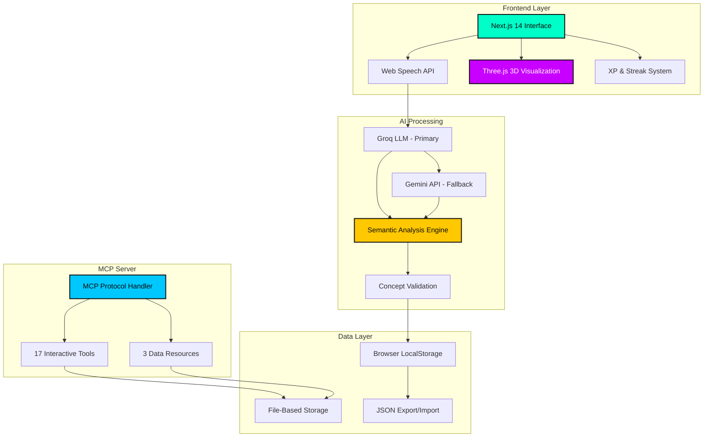

<div align="center">

# Explainr

### Master Any Concept Through AI-Powered Active Recall

[](https://nextjs.org/)
[](https://www.typescriptlang.org/)
[](https://vercel.com)
[](https://modelcontextprotocol.io)
[](LICENSE)

**[Live Demo](https://explainr.vercel.app)** • **[MCP Integration](#mcp-server-integration)** • **[Documentation](docs/)**


</div>

---

## What is Explainr?

Explainr transforms the **Feynman Technique** into an interactive, gamified learning experience. Explain concepts out loud to AI personas, receive instant feedback, and watch your knowledge galaxy expand as you master new topics.

> *"If you can't explain it simply, you don't understand it well enough."* — Richard Feynman

### Why Explainr?

Traditional learning is passive. **Explainr makes you the teacher.** By forcing you to articulate concepts in your own words, it exposes gaps in understanding that passive reading never reveals. The result? Deeper comprehension, longer retention, and genuine mastery.

---

## Key Features

<table>
<tr>
<td width="50%" valign="top">

### **Adaptive AI Personas**
Choose from 5 distinct personalities, each designed to challenge you differently:

- **Toddler** - Explain without jargon. Forces true simplicity.
- **Peer** - Conversational depth. Tests practical understanding.
- **Frat Bro** - Casual analogies. Makes complex topics relatable.
- **CEO** - Business impact. Connects theory to real-world value.
- **Professor** - Academic rigor. Demands precision and depth.

Each persona adapts its questions based on your confusion level, creating a dynamic learning experience that evolves with your understanding.

### **Voice-First Learning**
Speak naturally while our AI analyzes:
- **Pace** - Are you hesitating? Rushing through?
- **Clarity** - Is your explanation coherent?
- **Confidence** - Do you sound uncertain?
- **Jargon Usage** - Are you hiding behind buzzwords?

No typing. No friction. Just pure, unfiltered explanation.

### **Knowledge Galaxy Visualization**
Your learning journey rendered as an interactive 3D constellation:
- **Nodes** represent mastered topics
- **Connections** show semantic relationships
- **Size** indicates mastery level
- **Color** reflects recency of practice

Watch your knowledge expand from isolated facts into an interconnected web of understanding.

</td>
<td width="50%" valign="top">

### **Gamification That Works**
Learning shouldn't feel like work. Explainr turns mastery into a game:

**XP System**
- Earn points for every completed session
- Bonus XP for high-quality explanations
- Level up as you progress

**Streak Tracking**
- Build daily learning habits
- Maintain momentum with visual feedback
- Compete with your past self

**Commitment Grid**
- GitHub-style activity heatmap
- See your consistency at a glance
- Identify patterns in your learning

**Achievement Unlocks**
- Milestone rewards for dedication
- Special badges for mastery
- Progress visualization

### **Real-Time Feedback**
**Liquid Avatar** - A mercury-like blob that reacts to AI confusion:
- **Calm** - You're explaining clearly
- **Agitated** - The AI is confused
- **Chaotic** - Major gaps detected

**Checklist Protocol** - AI validates understanding against key concepts:
- Identifies what you covered
- Highlights what you missed
- Provides targeted feedback loops

### **Privacy-First Design**
- Local-only processing available
- Your voice, your data, your control
- Optional cloud sync for multi-device access

</td>
</tr>
</table>

---

## Architecture


---

## Quick Start

### **Use the Live App**
Visit **[explainr.vercel.app](https://explainr.vercel.app)** and start learning immediately. No installation required.

## MCP Server Integration

### **Your Learning Data, Everywhere**

Explainr isn't just a web app—it's a **learning platform that follows you**. Through the Model Context Protocol (MCP), your knowledge graph, sessions, and progress become accessible from any AI assistant you use.

**Imagine this:**
- You're coding in VS Code. Ask **Cline** to create a learning session on the algorithm you're implementing.
- You're chatting with **ChatGPT Desktop**. Ask it to show your knowledge graph and identify weak areas.
- You're using **Claude Desktop** for research. Have it search your past sessions for related concepts.

**One learning system. Every AI tool.**

### **Why This Changes Everything**

**Traditional Problem:**  
Your learning data is trapped in silos. Notes in Notion. Flashcards in Anki. Sessions in random apps. Nothing talks to each other.

**Explainr's Solution:**  
Your entire learning journey—every session, every topic, every connection—becomes a **queryable knowledge base** that any AI can access. No copy-pasting. No context-switching. Just seamless integration.

### **Real-World Use Cases**

**For Developers (VS Code + Cline)**
```
You: "I just learned about React Hooks. Create an Explainr session."
Cline: *Creates session, starts voice mode*
You: *Explains useState and useEffect*
Cline: "Session complete! 85% mastery. Added to your knowledge graph."
```

**For Researchers (Claude Desktop)**
```
You: "Search my Explainr sessions for anything about neural networks"
Claude: *Returns 3 sessions with summaries*
You: "Show me the knowledge graph connections"
Claude: *Displays how neural networks connect to backpropagation, optimization, etc.*
```

**For Students (ChatGPT Desktop)**
```
You: "What topics should I review before my exam?"
ChatGPT: *Analyzes your Explainr data*
"You have 3 topics below 60% mastery: Thermodynamics (45%), Quantum Mechanics (52%), Statistical Mechanics (58%)"
```

### **What Makes This Powerful**

| Feature | Benefit |
|---------|---------|
| **Cross-Platform** | Use Explainr from any AI tool you already use |
| **Conversational Access** | Query your learning data in natural language |
| **Automated Workflows** | Create sessions, update mastery, track progress—all from chat |
| **No Context Loss** | Your AI assistant knows your entire learning history |
| **Privacy-First** | Data stays local. MCP server runs on your machine |

### **Supported AI Clients**

| Client | Platform | Setup Time | Status |
|--------|----------|------------|--------|
| **Cline** | VS Code Extension | 2 minutes | Fully Supported |
| **Claude Desktop** | macOS/Windows App | 2 minutes | Fully Supported |
| **ChatGPT Desktop** | macOS/Windows App | 2 minutes | Fully Supported |
| **Continue** | VS Code Extension | 3 minutes | Fully Supported |

### **Quick Setup - VS Code (Cline)**

**Why Cline?** Code while you learn. Create sessions on-the-fly as you encounter new concepts.

1. Install **Cline** extension from VS Code marketplace
2. Open Cline settings (gear icon)
3. Add MCP server:

```json
{
  "mcpServers": {
    "explainr": {
      "command": "node",
      "args": ["path/to/explainr/mcp-server/dist/index.js"]
    }
  }
}
```

4. Restart VS Code
5. Try it: `"Create a Docker learning session with professor persona"`

**What You Can Do:**
- Create sessions without leaving your editor
- Query your knowledge graph while coding
- Track learning progress alongside development
- Search past sessions for reference

### **Quick Setup - Claude Desktop**

**Why Claude?** Best-in-class reasoning. Perfect for deep technical discussions and concept exploration.

**Config File:**
- **macOS**: `~/Library/Application Support/Claude/claude_desktop_config.json`
- **Windows**: `%APPDATA%\Claude\claude_desktop_config.json`

```json
{
  "mcpServers": {
    "explainr": {
      "command": "node",
      "args": ["C:\\absolute\\path\\to\\explainr\\mcp-server\\dist\\index.js"]
    }
  }
}
```

Restart Claude Desktop. Your learning data is now accessible.

**What You Can Do:**
- Discuss concepts and have Claude create sessions automatically
- Ask Claude to analyze your knowledge gaps
- Get personalized learning recommendations based on your graph
- Export/import data for backup

### **Quick Setup - ChatGPT Desktop**

**Why ChatGPT?** Familiar interface. Great for quick queries and casual learning.

**Config File:**
- **Windows**: `%APPDATA%\OpenAI\ChatGPT\mcp_config.json`
- **macOS**: `~/Library/Application Support/OpenAI/ChatGPT/mcp_config.json`

Same configuration format as Claude. Restart ChatGPT Desktop after adding.

**What You Can Do:**
- Check your learning stats during conversations
- Create sessions on topics you're discussing
- Get instant feedback on your knowledge graph
- Track streaks and XP from any chat

### **Available MCP Tools**

<details>
<summary><b>View All 17 Tools (Click to Expand)</b></summary>

**Session Management (5 tools)**
- `create_session` - Start new learning session with topic and persona
- `add_session_round` - Add conversation round to active session
- `end_session` - Complete session and calculate mastery score
- `delete_session` - Remove session from history
- `rename_session` - Update session topic name

**Knowledge Graph Operations (3 tools)**
- `add_topic` - Add new topic to knowledge graph
- `update_topic_mastery` - Modify mastery percentage
- `delete_topic` - Remove topic from graph

**Progress & Analytics (6 tools)**
- `get_knowledge_summary` - Overview of all topics by domain
- `get_learning_progress` - XP, level, streak statistics
- `list_topics` - All topics grouped by domain
- `search_sessions` - Find sessions by keyword
- `get_session_details` - Full conversation transcript
- `get_topic_connections` - Semantic relationships

**Data Management (3 tools)**
- `export_data` - Export all data as JSON
- `import_data` - Import data from JSON backup
- `clear_all_data` - Reset all learning data (requires confirmation)

</details>

**Full Setup Guide:** [MCP-SETUP.md](MCP-SETUP.md)  
**Tool Documentation:** [mcp-server/TOOLS.md](mcp-server/TOOLS.md)

---

## Technology Stack

| Layer | Technologies |
|-------|-------------|
| **Frontend** | Next.js 14, React 18, TypeScript 5 |
| **Styling** | Tailwind CSS, Framer Motion, Custom Shaders |
| **3D Graphics** | Three.js, React Three Fiber, GLSL |
| **AI Models** | Groq (Llama 3), Google Gemini 1.5 |
| **Voice** | Web Speech API, Real-time Transcription |
| **Storage** | Browser LocalStorage, File-based JSON |
| **Protocol** | Model Context Protocol (MCP) SDK |
| **Deployment** | Vercel Edge Network |

---

## Use Cases

**For Students**
- Master complex subjects faster
- Prepare for exams with active recall
- Identify knowledge gaps before tests

**For Professionals**
- Learn new technologies efficiently
- Explain technical concepts to stakeholders
- Build deeper understanding of your field

**For Educators**
- Assess student understanding
- Create interactive learning experiences
- Track progress over time

**For Self-Learners**
- Build genuine expertise, not surface knowledge
- Stay motivated with gamification
- Visualize your learning journey

---

## License

MIT License - see [LICENSE](LICENSE) for details.

---

